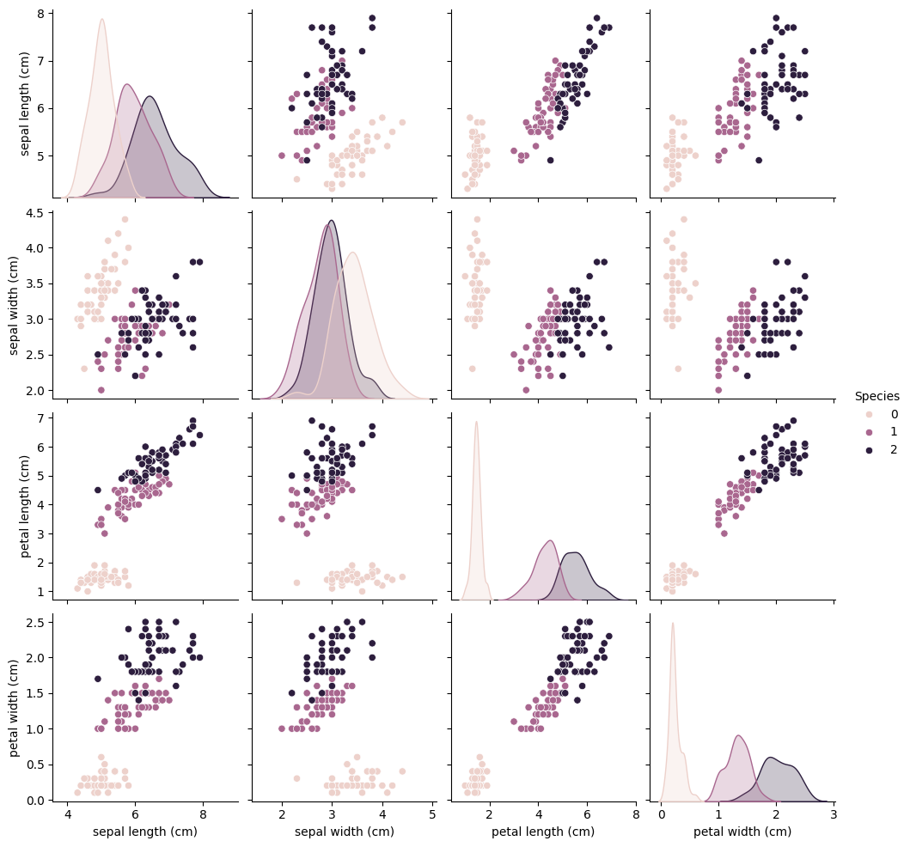
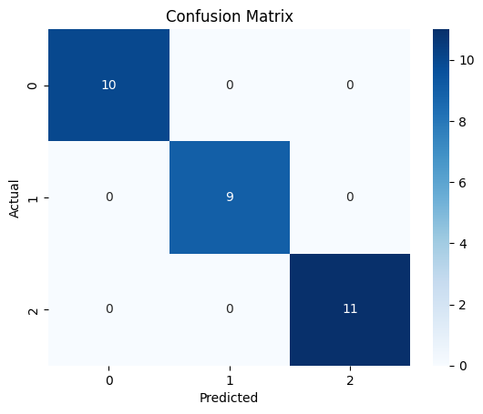

# CodeAlpha_IrisFlowerClassification
## Project Overview
This project is completed as part of the CodeAlpha Data Science Internship.
The objective is to classify Iris flowers into three species:
* Setosa
* Versicolor
* Virginica
using machine learning techniques.

## Technologies Used
* Python
* Pandas
* NumPy
* Scikit-learn
* Matplotlib
* Seaborn

## Machine Learning Model
Random Forest Classifier

## Workflow
1. Data Loading
2. Data Exploration
3. Data Visualization
4. Data Preprocessing
5. Model Training
6. Model Evaluation

## Project Visualizations
### Pair Plot

### Confusion Matrix

## Results
Model Accuracy: 96.67%

The Random Forest Classifier successfully classified the Iris flower species with excellent performance.

## Author
Jerlin Jannett M

CodeAlpha Data Science Internship
